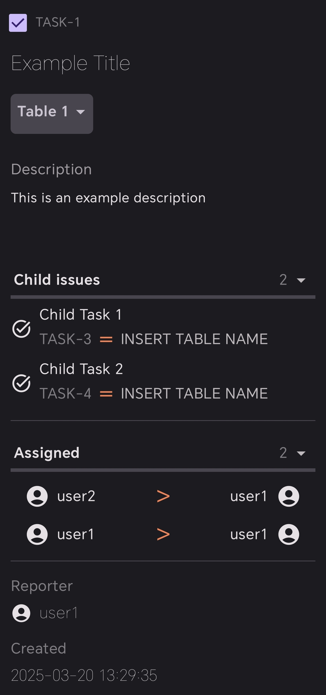

# Bugtracker

Android app used for project management

Link to the backend can be found [here](https://github.com/d-najd/Bugtracker-2.0-backend)

# Preview

<table>
    <tr>
        <th>Tasks Screen</th>
        <th>Task Screen</th>
        <th>Task Screen</th>
    </tr>
    <tr>
<td>


</td>
<td>


</td>
<td>


</td>
    </tr>
</table>

<table>
    <tr>
        <th>Project Screen</th>
        <th>User Management Screen</th>
        <th>Project Details Screen</th>
    </tr>
<tr>
<td>


</td>

<td>


</td>

<td>


</td>

</tr>
</table>

# Technologies Used

* Material 3 UI
* Jetpack Compose
* Kotlin
* MVVM
* Retrofit
* Voyager
* Injekt
* KMPAuth (OAuth)

# Setup

1. Git clone the project

```shell
git clone https://github.com/d-najd/portfolio.git
```

2. Change the config to mock (mock implementations for development) or remote (using backend) in
   ```domain/DomainModule.kt```
3. Run the project with the latest version of android studio
